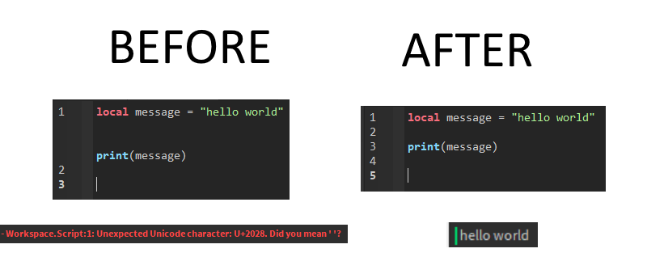

# shift-enter-fix
A temporary solution to a bug with the Roblox Studio script editor that causes invisible unicode characters to be added when the user presses shift + enter.

Install the plugin here: https://www.roblox.com/library/5173182694/shift-enter-fix

